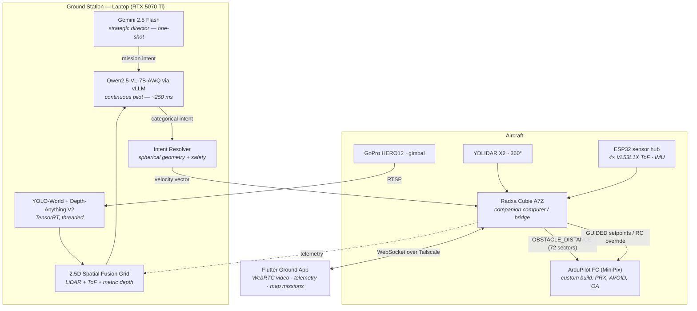

# Autonomous Cinematic Drone

**A two-brain autonomous aerial cinematography system: a local vision-language model flies the aircraft frame-by-frame while a cloud reasoning model directs the shot.**

[](LICENSE)
[](https://ardupilot.org)
[](https://huggingface.co/Qwen)
[](docs/VERIFICATION.md)
[](#project-status)

---

## Overview

This project builds a drone that is told *what to film*, not *where to fly*.

A human types a natural-language objective — *"find the sofa and film it from a good angle"*. A cloud reasoning model (Gemini) converts that into a strategic plan. A local vision-language model (Qwen2.5-VL-7B) then acts as the continuous pilot, looking at the live camera feed and fused sensor data roughly four times a second and deciding where to go next. Deterministic code converts those decisions into precise, clearance-checked velocity vectors, which a companion-computer bridge translates into MAVLink commands for an ArduPilot flight controller.

No flight path is scripted. No cinematic maneuver is hardcoded. Orbits, follows and approaches **emerge** from per-tick intent.

### Why this is architecturally unusual

Most LLM-controlled robotics either (a) ask the model for raw numeric velocities, which fails badly, or (b) restrict the model to selecting from hardcoded behaviours, which is not autonomy. This project does neither. It uses a **hybrid intent architecture** in which the model supplies *semantics* and code supplies *geometry* — described in full below and in [docs/ARCHITECTURE.md](docs/ARCHITECTURE.md).

---

## The core contribution: Hybrid Intent

Early testing produced a decisive, measurable result. When the vision-language model was asked to output velocity vectors directly, its **written reasoning was correct but its numbers were wrong** — it would correctly state *"the left side is open, I should move left"* and then emit a velocity that drove it into the wall. Measured on real FPV frames:

| Output mode | Correct navigation decisions |
|---|---|
| Model emits raw velocity vectors | **5%** |
| Model emits a direction word, code computes the vector | **100%** |

This is the *say–do gap*: the model understands space but cannot reliably ground that understanding in continuous numeric output.

The architecture splits the problem along that fault line:

```
  MODEL RESPONSIBILITY                 CODE RESPONSIBILITY
  (semantics — reliable)               (geometry — exact)

  head   : "fwd_left"          ──►     azimuth θ = −45°
  climb  : "climb"             ──►     elevation φ = +12°
  pace   : "creep"             ──►     speed scalar
  yaw    : "face_subject"      ──►     yaw rate from subject bearing
                                       ────────────────────────────
                                       vx = s·cos φ·cos θ
                                       vy = s·cos φ·sin θ
                                       vz = s·sin φ
                                       clamped to live FC limits
                                       re-steered if sector blocked
```

The model emits a compact categorical token such as `{"head":"fwd_left"}` — roughly six output tokens. Because inference latency at short outputs is dominated by token count, this also **cut decision latency from 440 ms to 209 ms** while *increasing* correctness. Reliability and speed improved together.

Movement is fully spherical: any azimuth, any climb slope, any pace, any yaw behaviour. A sustained *"move sideways + keep facing the subject"* intent produces a mathematically perfect orbit — without an `orbit()` function existing anywhere in the codebase.

---

## System architecture



### Division of responsibility

| Layer | Owns | Rationale |
|---|---|---|
| **Gemini (cloud)** | Strategic intent, subject selection, shot concept | Strong reasoning, latency-tolerant, called once per objective |
| **Qwen-VL (local)** | Per-frame navigation semantics | Runs on-site, no network dependency in the control loop |
| **Resolver (code)** | Exact geometry, clearance caps, envelope limits | Deterministic, auditable, testable |
| **Bridge (companion)** | MAVLink translation, mission upload, sensor forwarding | Owns the only hardware link to the FC |
| **ArduPilot (FC)** | Stabilisation, wind rejection, position hold, avoidance braking | Purpose-built, flight-proven, runs without the AI |

A deliberate principle throughout: **the AI never does what the flight controller does better.** The AI chooses intent and flight *mode*; ArduPilot handles stabilisation, wind rejection and low-level avoidance. If the AI stops, the aircraft remains controllable.

---

## Capabilities

- **Natural-language missions** — objectives in plain English, no waypoints required
- **Emergent cinematography** — orbits, approaches and subject tracking arise from intent composition, not scripted routines
- **Full spherical motion** — arbitrary azimuth, climb slope, pace and yaw behaviour
- **Multi-sensor fusion** — 360° LiDAR, 4× angled time-of-flight, monocular metric depth, open-vocabulary detection, fused into a 2.5D occupancy grid with short-term obstacle memory
- **Direction-aware obstacle avoidance** — the full 360° ring is published to the flight controller as `OBSTACLE_DISTANCE`, enabling native BendyRuler/Dijkstra path deviation
- **GPS-denied indoor flight** — 2D LiDAR SLAM produces `VISION_POSITION_ESTIMATE` for the EKF; velocity is delivered as ALT_HOLD attitude override when no position fix exists
- **Map route missions** — waypoints tapped on a map are uploaded via the MAVLink mission protocol and flown in AUTO with native avoidance
- **App-defined return policy** — return-to-home / return-to-operator / land-in-place, at an operator-defined battery threshold
- **Motion-triangulation depth anchoring** — camera motion parallax refines monocular depth scale toward centimetre class

---

## Verification

This system commands a physical aircraft, so it is validated in layers. Every figure below is reproducible from the harnesses in this repository.

| Layer | What it proves | Result |
|---|---|---|
| Static compile | All production modules import and compile | **14/14** |
| Command-path tests | Bridge command handling against a recording MAVLink stub | **37/37** |
| Wire-link verification | Every message shape across app ↔ bridge ↔ laptop, incl. real safety gate | **44/44** |
| Depth anchor + memory | Triangulated scale recovery and obstacle persistence vs. synthetic ground truth | **11/11** |
| **SITL firmware-in-the-loop** | Commands drive **real ArduPilot firmware**: arm, modes, takeoff, velocity flight, RTL, land, GPS-denied override | **13/13** |
| **Route missions vs. firmware** | The app's exact mission packet → handshake upload → AUTO → all waypoints reached | **10/10** |
| Full-stack simulated missions | Complete AI stack flying photorealistic scenes, incl. one flown entirely by real firmware | **7 missions completed** |

**Measured performance**

| Metric | Value |
|---|---|
| End-to-end decision loop (perception → VLM → resolver → MAVLink) | **236 ms median** (4.2 Hz) |
| Pilot model decision latency | ~209 ms |
| YOLO-World (TensorRT FP16 vs. PyTorch) | 24.0 ms → **11.5 ms** (2.10×) |
| YOLOv8s (TensorRT FP16 vs. PyTorch) | 17.2 ms → **7.3 ms** (2.35×) |
| LiDAR SLAM positional drift | ~10 cm mean over a 6×6 m circuit |
| Pilot model selection benchmark | 7B-AWQ **98%** vs. 3B spatial-LoRA 27% |

Full methodology: [docs/VERIFICATION.md](docs/VERIFICATION.md).

---

## Project status

**Pre-flight validation.** Honest maturity assessment:

| Area | Status |
|---|---|
| AI stack, resolver, safety logic | ✅ Complete and verified |
| Bridge ↔ firmware command paths | ✅ Verified against real ArduPilot (SITL) |
| Sensor fusion and spatial grid | ✅ Complete; LiDAR→FC ingestion confirmed on hardware |
| Ground app (telemetry, video, missions) | ✅ Functional |
| Hardware integration | 🟡 Partially validated on the aircraft |
| **Flight testing** | 🔴 **Not yet performed** |

Nothing in this repository has been validated in powered flight. Simulation and firmware-in-the-loop results are not a substitute for flight testing. See [SAFETY.md](SAFETY.md).

---

## Hardware

| Subsystem | Component |
|---|---|
| Flight controller | MiniPix, ArduCopter 4.6.x custom build (PRX, AVOID, OA_BendyRuler, SmartRTL, VISO, Terrain) |
| Companion computer | Radxa Cubie A7Z (UART to FC, USB LiDAR, WiFi) |
| Ground compute | Laptop, NVIDIA RTX 5070 Ti 12 GB (vLLM + perception) |
| LiDAR | YDLIDAR X2, 360° planar, 8 m |
| Camera | GoPro HERO12 on a controllable gimbal, RTSP via MediaMTX |
| Proximity | 4× VL53L1X time-of-flight (2 up / 2 down, 45° outboard) via PCA9548A |
| Airframe | Quad X, 1.6–1.7 kg AUW, 3S 5400 mAh |
| Link | Tailscale mesh over a 2.4 GHz hotspot |

Bill of materials, wiring, and **hard-won power-integrity requirements**: [docs/HARDWARE.md](docs/HARDWARE.md).

> ⚠️ **Read the power-integrity section before building.** Five companion computers were destroyed during development by a single root cause. The mitigation costs under USD 10 and is non-optional.

---

## Quick start

### Prerequisites
- Python 3.10+, NVIDIA GPU with CUDA 12.x (12 GB+ VRAM recommended)
- WSL2 (Windows hosts) for the vLLM inference server
- ArduPilot-compatible flight controller
- Google Gemini API key

### 1 — Ground station
```bash
git clone <repository-url> && cd cinematic-drone
pip install -r requirements.txt
export GEMINI_API_KEY="your-key-here"
```

### 2 — Start the pilot inference server
```bash
bash scripts/start_vllm_pilot.sh          # serves Qwen2.5-VL-7B-AWQ on :8100
```

### 3 — Build TensorRT engines (optional, ~2× perception speedup)
```bash
python scripts/build_trt_world.py         # bakes the nav vocabulary into the engine
```

### 4 — Companion computer
```bash
scp raxda_bridge/real_bridge_service.py raxda_bridge/lidar_pose.py     shreyash@<companion-ip>:~/raxda_bridge/
ssh shreyash@<companion-ip> "sudo systemctl restart drone-bridge"
```
First-time provisioning (serial permissions, UART overlay, systemd unit, read-only root) and the
required start-up order are documented in **[docs/DEPLOYMENT.md](docs/DEPLOYMENT.md)**.

### 5 — Launch the director
```bash
cd ai/camera_brain && python -m laptop_ai.director_core
```

### Validate without hardware
```bash
python tests/sitl_bridge_test.py          # 13 checks vs. real ArduPilot SITL
python tests/sitl_mission_test.py         # 10 checks, map-route missions
```

---

## Repository layout

```
ai/camera_brain/laptop_ai/      Ground-station AI stack
  ├─ director_core.py           Orchestrator: perception, fusion, mission, flight-mode logic
  ├─ local_er_brain.py          Pilot VLM client + hybrid-intent resolver (spherical geometry)
  ├─ spatial_grid.py            2.5D sensor fusion, obstacle memory, operator visualisation
  ├─ ai_depth_estimator.py      Monocular metric depth
  ├─ depth_anchor.py            Motion-triangulation depth scale recovery
  ├─ nav_costmap.py             Local A* costmap planner
  └─ autopilot_controller.py    Velocity/command abstraction

raxda_bridge/                   Companion computer
  ├─ real_bridge_service.py     MAVLink bridge, sensor forwarding, mission upload, safety gate
  └─ lidar_pose.py              2D LiDAR SLAM → VISION_POSITION_ESTIMATE

esp32/esp32_firmware/           Sensor hub firmware (ToF, IMU, LED, gimbal)
docs/                           Architecture, hardware, verification, build journal
tests/                          SITL and integration harnesses
```

---

## Documentation

| Document | Contents |
|---|---|
| [docs/ARCHITECTURE.md](docs/ARCHITECTURE.md) | Detailed design: hybrid intent, fusion, safety layers, control paths |
| [docs/BUILD_JOURNAL.md](docs/BUILD_JOURNAL.md) | Chronological engineering record — decisions, failures, root causes |
| [docs/DEPLOYMENT.md](docs/DEPLOYMENT.md) | Provisioning, deploying the bridge, start-up order, troubleshooting |
| [docs/HARDWARE.md](docs/HARDWARE.md) | Bill of materials, wiring, power integrity, FC parameters |
| [docs/VERIFICATION.md](docs/VERIFICATION.md) | Test methodology, harnesses, results |
| [SAFETY.md](SAFETY.md) | Operating limits, pre-flight procedure, failure modes |

---

## Roadmap

- [ ] First powered flight validation (indoor GPS-denied, then outdoor GPS)
- [ ] Bench-verify BendyRuler path deviation with the live proximity ring
- [ ] Optical-flow module for robust indoor position hold
- [ ] Omnidirectional perception via panoramic camera (Fly360-style spherical policy)
- [ ] Onboard inference migration (Jetson-class) to remove the ground-link dependency
- [ ] Learned visuomotor policy for high-speed cinematic tracking

---

## License

Licensed under the **Apache License 2.0** — see [LICENSE](LICENSE).

Apache-2.0 was selected over MIT for its **express patent grant** (Section 3), appropriate for a system containing novel control architecture, and for its explicit attribution and modification-notice requirements.

Third-party components retain their own licenses; see [NOTICE](NOTICE) for full attribution — including an important **AGPL-3.0 compliance note** regarding the Ultralytics detector if you intend commercial or hosted deployment.

---

## Citation

```bibtex
@software{agarwal2026cinematicdrone,
  author  = {Agarwal, Shreyash},
  title   = {Autonomous Cinematic Drone: A Two-Brain Vision-Language
             Architecture for Aerial Cinematography},
  year    = {2026},
  license = {Apache-2.0}
}
```

---

## Disclaimer

This software commands physical aircraft capable of causing injury, death and property damage. It is provided **without warranty of any kind**. The operator is solely responsible for safe operation and for compliance with all applicable aviation regulations. Read [SAFETY.md](SAFETY.md) before operating.
