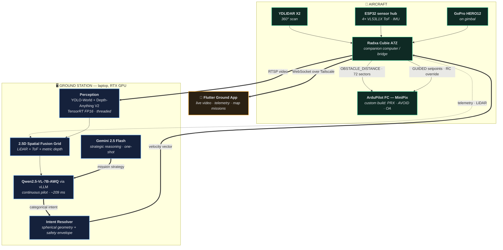

# Autonomous AI Drone

**A two-brain AI system that takes a goal in plain language and completes complex, multi-stage missions on its own — perceiving, reasoning, deciding and flying, with no scripted paths and no hardcoded behaviours.**

[](LICENSE)
[](https://ardupilot.org)
[](https://huggingface.co/Qwen)
[](docs/VERIFICATION.md)
[](#project-status)

---

## Overview

This project builds a drone that is given an **objective**, not a flight plan.

An operator states a goal in plain English — *"survey this room, find the equipment cabinet, inspect it, then land somewhere safe."* A cloud reasoning model converts that into a strategy. A local vision-language model then acts as the continuous pilot, looking at live camera and fused sensor data roughly four times a second and deciding what to do next. Deterministic code converts each decision into a precise, clearance-checked velocity vector, which a companion-computer bridge translates into MAVLink commands for an ArduPilot flight controller.

The drone decides **where to go, what to examine, how to get there, and when the objective is met.** No waypoint list is required. No behaviour is scripted.

### Why this is architecturally unusual

Most LLM-controlled robotics either (a) ask the model for raw numeric velocities, which fails badly, or (b) restrict the model to picking from a menu of hardcoded behaviours, which is not autonomy. This project does neither. It uses a **hybrid intent architecture** in which the model supplies *semantics* and code supplies *geometry* — measured to raise navigation correctness from 5% to 100% while simultaneously halving latency. See [The core contribution](#the-core-contribution-hybrid-intent).

That boundary has a second benefit: because the model's entire output is a small categorical object, the reasoning model is replaceable without touching flight code — so the system's intelligence scales with whatever compute it is given. See [Intelligence is not fixed by the airframe](#intelligence-is-not-fixed-by-the-airframe).

---

## What "complex tasks" means here

Autonomy is only meaningful if the machine handles the parts a script cannot. This system composes primitive competences into multi-stage missions, adapting as conditions change.

### Primitive competences

| Competence | Description |
|---|---|
| **Semantic search** | Locate an object described in natural language, in a space it has never seen, using open-vocabulary detection rather than a fixed class list |
| **Spatial exploration** | Systematically survey an unknown area, cataloguing what it finds, in darkness or without GPS |
| **Approach and inspection** | Navigate to a located object, hold a stable standoff, examine it from a chosen angle |
| **Precision landing** | Identify a *specific viable surface* and land on it — including scoring candidate sites itself and rejecting hazardous ones |
| **Constrained transit** | Fly to a defined altitude band and traverse an obstacle-dense space, e.g. crossing a room at 0.35 m to reach a window |
| **Structured survey** | Perform a full rotational scan and build an object inventory of the surroundings |
| **Target circumnavigation** | Orbit a subject while keeping it framed, at a maintained radius |
| **Dynamic evasion** | Detect, track and avoid *moving* obstacles while continuing the mission |
| **Route execution** | Fly an operator-drawn map route with live, native obstacle deviation |
| **Self-directed goal selection** | Choose its own target and its own landing site when the objective leaves those open |

### Composition into missions

These chain into missions with dependencies, conditions and success criteria. Validated examples:

**8-stage indoor mission** — scan the room and catalogue it → descend to 0.35 m → traverse to the window → climb and inspect it for 3 s → locate the television → circumnavigate it through 180° under observation → locate the laptop → hold station above it for 5 s → precision-land on the ottoman. Executed while **dodging a patrolling obstacle 30 times**, compensating for wind gusts, and surrounded by 14 object classes its detector had no vocabulary for (visible only to LiDAR and depth).

**12-stage two-domain mission** — complete an indoor objective, **exit through a window**, and continue outdoors: survey the street, locate a vehicle by colour, circumnavigate it fully, overfly structures at altitude, identify a second vehicle, hold above it, then land at a self-selected site.

**Fully self-directed mission** — given an objective that named **no target and no landing site**, leaving both to the system, it explored for 12 s, catalogued seven object classes, selected a target on its own reasoning, examined it, then **scored 126 candidate floor patches from its own sensor model** and landed on the one with the greatest all-round clearance.

### What makes these non-trivial

- **The environment is unknown at launch.** No prior map, no pre-labelled targets.
- **Objectives are semantic, not geometric.** "Find the cabinet" has no coordinates.
- **Conditions change during execution.** Obstacles move; wind pushes; targets leave view.
- **Stages have real success criteria.** "Inspect for 3 seconds at the window" requires arriving, stabilising, and verifying — not passing nearby.
- **Failure must be safe.** Every stage runs inside deterministic safety layers that can override the model.

---

## The core contribution: Hybrid Intent

Early testing produced a decisive, measurable result. When the vision-language model was asked to output velocity vectors directly, its **written reasoning was correct but its numbers were wrong** — it would correctly state *"the left side is open, I should move left"* and then emit a velocity that drove it into the wall. Measured on real flight footage:

| Output mode | Correct navigation decisions |
|---|---|
| Model emits raw velocity vectors | **5%** |
| Model emits a direction word, code computes the vector | **100%** |

This is the *say–do gap*: the model understands space but cannot reliably ground that understanding in continuous numeric output.

The architecture splits the problem along exactly that fault line:

```
  MODEL RESPONSIBILITY                 CODE RESPONSIBILITY
  (semantics — reliable)               (geometry — exact)

  head   : "fwd_left"          ──►     azimuth θ = −45°
  climb  : "climb"             ──►     elevation φ = +12°
  pace   : "creep"             ──►     speed scalar
  yaw    : "face_subject"      ──►     yaw rate from subject bearing
                                       ────────────────────────────
                                       vx = s·cos φ·cos θ
                                       vy = s·cos φ·sin θ
                                       vz = s·sin φ
                                       clamped to live FC limits
                                       re-steered if sector blocked
```

The model emits a compact categorical token such as `{"head":"fwd_left"}` — roughly six output tokens. Because inference latency at short outputs is dominated by token count, this also **cut decision latency from 440 ms to 209 ms** while *increasing* correctness. Reliability and speed improved together.

Movement is fully spherical: any azimuth, any climb slope, any pace, any yaw behaviour. Complex behaviours **emerge** from composition rather than existing as routines — a sustained *"move sideways + keep facing the target"* intent produces a mathematically exact orbit, with no `orbit()` function anywhere in the codebase.

---

## System architecture



### Division of responsibility

| Layer | Owns | Rationale |
|---|---|---|
| **Gemini (cloud)** | Mission strategy, target selection, stage decomposition | Strong reasoning, latency-tolerant, called once per objective |
| **Qwen-VL (local)** | Per-frame navigation semantics | Runs on-site, no network dependency in the control loop |
| **Resolver (code)** | Exact geometry, clearance caps, envelope limits | Deterministic, auditable, testable |
| **Bridge (companion)** | MAVLink translation, mission upload, sensor forwarding | Owns the only hardware link to the flight controller |
| **ArduPilot (FC)** | Stabilisation, wind rejection, position hold, avoidance braking | Purpose-built, flight-proven, runs without the AI |

A deliberate principle throughout: **the AI never does what the flight controller does better.** The AI chooses intent and flight *mode*; ArduPilot handles stabilisation, wind rejection and low-level avoidance. If the AI stops, the aircraft remains controllable.

---

## Intelligence is not fixed by the airframe

The reasoning is **not baked into the aircraft.** The airframe carries sensors, a bridge and a flight controller; cognition runs on whatever machine sits at the other end of the link. That separation is the point, and it has a concrete consequence:

> **The drone becomes smarter by upgrading the machine that thinks for it — not by rebuilding the drone.**

This works because the pilot model's entire contract with the rest of the system is a small categorical intent object (see [Hybrid Intent](#the-core-contribution-hybrid-intent)). It emits a direction word, a pace, a yaw behaviour. It never emits geometry, never touches MAVLink, and never makes a safety decision. **Any model capable of producing that object can fly this aircraft.** Substituting one is a configuration change, not a rewrite — flight code, safety layers and firmware are untouched.

This is not a hypothetical property. The pilot has already been swapped across model families and quantisations during development, and the strategic brain is a separate, independently replaceable model.

| Compute tier | What changes | What does **not** change |
|---|---|---|
| Larger or newer pilot model | Better scene understanding, more reliable intent in cluttered and ambiguous scenes | Intent schema, resolver, safety envelope, firmware |
| Faster GPU | Higher control-loop rate, so faster reaction and higher safe speed caps | Control logic, MAVLink interface |
| More VRAM | Longer visual context, more frames per decision, richer memory of the scene | Bridge, flight modes |
| Onboard inference (Jetson-class) | Removes the ground-link dependency entirely | Everything above the link |

So the ceiling on this system's intelligence is set by the hardware you point at it and by the state of the art in vision-language models — **and both of those keep improving without any work on the aircraft.** Capability gained this way is inherited, not re-engineered: a model released next year raises the drone's competence the day it is swapped in.

### Two limits that do not move

Honesty matters more than the pitch here, so two constraints are worth stating plainly.

**Safety does not scale with the model, by design.** A more capable pilot model earns no additional authority. Clearance caps, direction correction, envelope clamping and return policy remain in deterministic code, and the model's choice remains a *preference that code may override*. A smarter model makes better proposals; it does not get to bypass the layers that veto them.

**Latency is a real budget, not a free variable.** The loop closes at 236 ms median. A substantially larger model that cannot hold the pilot stage near ~209 ms buys reasoning quality at the cost of reaction time — which, on an aircraft, is a genuine trade rather than a straight upgrade. Faster hardware is what converts a bigger model into an actual gain.

---

## Capabilities

- **Natural-language objectives** — goals in plain English, no waypoints required
- **Emergent behaviour** — orbits, approaches and tracking arise from intent composition, not scripted routines
- **Full spherical motion** — arbitrary azimuth, climb slope, pace and yaw behaviour
- **Multi-sensor fusion** — 360° LiDAR, 4× angled time-of-flight, monocular metric depth, open-vocabulary detection, fused into a 2.5D occupancy grid with short-term obstacle memory
- **Direction-aware obstacle avoidance** — the full 360° ring is published to the flight controller as `OBSTACLE_DISTANCE`, enabling native BendyRuler/Dijkstra path deviation
- **GPS-denied indoor operation** — 2D LiDAR SLAM produces `VISION_POSITION_ESTIMATE` for the EKF; velocity is delivered as ALT_HOLD attitude override when no position fix exists
- **Map route missions** — waypoints tapped on a map are uploaded via the MAVLink mission protocol and flown in AUTO with native avoidance
- **Operator-defined return policy** — return-to-home / return-to-operator / land-in-place, at an operator-defined battery threshold
- **Motion-triangulation depth anchoring** — camera motion parallax refines monocular depth scale toward centimetre class

### Applicable domains

The same competences transfer directly to inspection (structures, infrastructure, equipment), search and location, indoor survey and mapping, security patrol, stock and asset checking, and environmental monitoring. Anywhere the objective is semantic and the environment is not known in advance.

---

## Verification

This system commands a physical aircraft, so it is validated in layers. Every figure below is reproducible from the harnesses in this repository.

| Layer | What it proves | Result |
|---|---|---|
| Static compile | All production modules import and compile | **14/14** |
| Command-path tests | Bridge command handling against a recording MAVLink stub | **37/37** |
| Wire-link verification | Every message shape across app ↔ bridge ↔ laptop, incl. real safety gate | **44/44** |
| Depth anchor + memory | Triangulated scale recovery and obstacle persistence vs. synthetic ground truth | **11/11** |
| **SITL firmware-in-the-loop** | Commands drive **real ArduPilot firmware**: arm, modes, takeoff, velocity flight, RTL, land, GPS-denied override | **13/13** |
| **Route missions vs. firmware** | The app's exact mission packet → handshake upload → AUTO → all waypoints reached | **10/10** |
| Full-stack simulated missions | Complete AI stack executing multi-stage missions, incl. one flown entirely by real firmware | **7 missions completed** |

**Measured performance**

| Metric | Value |
|---|---|
| End-to-end decision loop (perception → VLM → resolver → MAVLink) | **236 ms median** (4.2 Hz) |
| Pilot model decision latency | ~209 ms |
| YOLO-World (TensorRT FP16 vs. PyTorch) | 24.0 ms → **11.5 ms** (2.10×) |
| YOLOv8s (TensorRT FP16 vs. PyTorch) | 17.2 ms → **7.3 ms** (2.35×) |
| LiDAR SLAM positional drift | ~10 cm mean over a 6×6 m circuit |
| Pilot model selection benchmark | 7B-AWQ **98%** vs. 3B spatial-LoRA 27% |

Full methodology: [docs/VERIFICATION.md](docs/VERIFICATION.md).

---

## Project status

**Under flight test. Autonomy integration in progress.**

The aircraft is flying. The autonomous stack is being brought online against it
incrementally — each competence is validated on the bench, then in a controlled
flight envelope with a pilot on the sticks, before it is trusted to command the
aircraft unsupervised.

| Area | Status |
|---|---|
| AI stack, resolver, safety logic | ✅ Complete and verified |
| Bridge ↔ firmware command paths | ✅ Verified against real ArduPilot (SITL) |
| Sensor fusion and spatial grid | ✅ Complete; LiDAR→FC ingestion confirmed on hardware |
| Ground app (telemetry, video, missions) | ✅ Functional |
| Hardware integration | 🟡 On the aircraft; power-integrity rebuild in progress |
| **Piloted flight testing** | 🟡 **Underway** |
| **Autonomous mission execution** | 🟡 **In progress — not yet cleared for unsupervised flight** |

### What "in progress" means here

Flight testing follows the staged programme in [SAFETY.md](SAFETY.md): airframe and
link integrity first, then AI-commanded motion within a bounded envelope under
pilot supervision, and only then longer autonomous sequences. Authority is handed
to the autonomy stack one layer at a time, and a human retains override throughout —
RC override expiry, geofence, and the safety envelope are active in every stage.

Accordingly: the architecture and command paths are verified, the aircraft flies, and
autonomous behaviours are being validated on it now. **Full unsupervised autonomous
mission execution is not yet demonstrated in flight**, and simulation and
firmware-in-the-loop results remain no substitute for flight data. Results will be
recorded in [docs/VERIFICATION.md](docs/VERIFICATION.md) as each stage is cleared.

---

## Hardware

| Subsystem | Component |
|---|---|
| Flight controller | MiniPix, ArduCopter 4.6.x custom build (PRX, AVOID, OA_BendyRuler, SmartRTL, VISO, Terrain) |
| Companion computer | Radxa Cubie A7Z (UART to FC, USB LiDAR, WiFi) |
| Ground compute | Laptop, NVIDIA RTX 5070 Ti 12 GB (vLLM + perception) |
| LiDAR | YDLIDAR X2, 360° planar, 8 m |
| Camera | GoPro HERO12 on a controllable gimbal, RTSP via MediaMTX |
| Proximity | 4× VL53L1X time-of-flight (2 up / 2 down, 45° outboard) via PCA9548A |
| Airframe | Quad X, 1.6–1.7 kg AUW, 3S 5400 mAh |
| Link | Tailscale mesh over a 2.4 GHz hotspot |

Bill of materials, wiring, and **hard-won power-integrity requirements**: [docs/HARDWARE.md](docs/HARDWARE.md).

> ⚠️ **Read the power-integrity section before building.** Five companion computers were destroyed during development by a single root cause. The mitigation costs under USD 10 and is non-optional.

---

## Quick start

### Prerequisites
- Python 3.10+, NVIDIA GPU with CUDA 12.x (12 GB+ VRAM recommended)
- WSL2 (Windows hosts) for the vLLM inference server
- ArduPilot-compatible flight controller
- Google Gemini API key

### 1 — Ground station
```bash
git clone https://github.com/Shreyasnu7/Autonomous-AI-Drone.git && cd Autonomous-AI-Drone
pip install -r requirements.txt
export GEMINI_API_KEY="your-key-here"
```

### 2 — Start the pilot inference server
```bash
bash scripts/start_vllm_pilot.sh          # serves Qwen2.5-VL-7B-AWQ on :8100
```

### 3 — Build TensorRT engines (optional, ~2× perception speedup)
```bash
python scripts/build_trt_world.py         # bakes the nav vocabulary into the engine
```

### 4 — Companion computer
```bash
scp raxda_bridge/real_bridge_service.py raxda_bridge/lidar_pose.py \
    shreyash@<companion-ip>:~/raxda_bridge/
ssh shreyash@<companion-ip> "sudo systemctl restart drone-bridge"
```
First-time provisioning (serial permissions, UART overlay, systemd unit, read-only root) and the
required start-up order are documented in **[docs/DEPLOYMENT.md](docs/DEPLOYMENT.md)**.

### 5 — Launch the director
```bash
cd ai/camera_brain && python -m laptop_ai.director_core
```

### 6 — Ground application (optional)

```bash
cd app && flutter pub get && flutter build apk --release
```

Requires the Flutter SDK. The application connects to the companion computer over WebSocket; set the
address in its settings panel. Released binaries are not committed to this repository — build from
source, or attach a signed build to a GitHub Release.

### Validate without hardware
```bash
python tests/sitl_bridge_test.py          # 13 checks vs. real ArduPilot SITL
python tests/sitl_mission_test.py         # 10 checks, map-route missions
```

---

## Repository layout

```
ai/camera_brain/laptop_ai/      Ground-station AI stack
  ├─ director_core.py           Orchestrator: perception, fusion, mission, flight-mode logic
  ├─ local_er_brain.py          Pilot VLM client + hybrid-intent resolver (spherical geometry)
  ├─ spatial_grid.py            2.5D sensor fusion, obstacle memory, operator visualisation
  ├─ ai_depth_estimator.py      Monocular metric depth
  ├─ depth_anchor.py            Motion-triangulation depth scale recovery
  ├─ nav_costmap.py             Local A* costmap planner
  └─ autopilot_controller.py    Velocity/command abstraction

raxda_bridge/                   Companion computer
  ├─ real_bridge_service.py     MAVLink bridge, sensor forwarding, mission upload, safety gate
  └─ lidar_pose.py              2D LiDAR SLAM → VISION_POSITION_ESTIMATE

esp32/esp32_firmware/           Sensor hub firmware (ToF, IMU, LED, gimbal)

app/                            Flutter ground application (Android)
  ├─ lib/screens/               Control, connect, hangar, gallery, auth
  ├─ lib/services/              Telemetry (WebSocket), media, flight recorder, state
  └─ lib/widgets/               Artificial horizon, video feed, analytics, settings

cloud_ai/                       Strategic brain — Gemini director, orchestrator, mission memory
prompts/                        Prompt templates used by the strategic brain

raxda/                          Companion-side modules deployed to the aircraft by the setup scripts
control/ + mavlink/             Direct MAVLink command primitives (arm/takeoff/move/land) and the
                                connection layer they use — predate the bridge and are retained
                                for bench work; the flight path in use is raxda_bridge/

docs/                           Architecture, hardware, verification, deployment, build journal
tests/                          SITL and integration harnesses
```

Directories not listed above (`project_root/`, generated `artifacts/`) are superseded prototypes or
run output and are excluded from version control.

---

## Documentation

| Document | Contents |
|---|---|
| [docs/ARCHITECTURE.md](docs/ARCHITECTURE.md) | Detailed design: hybrid intent, fusion, safety layers, control paths |
| [docs/BUILD_JOURNAL.md](docs/BUILD_JOURNAL.md) | Chronological engineering record — decisions, failures, root causes |
| [docs/DEPLOYMENT.md](docs/DEPLOYMENT.md) | Provisioning, deploying the bridge, start-up order, troubleshooting |
| [docs/HARDWARE.md](docs/HARDWARE.md) | Bill of materials, wiring, power integrity, FC parameters |
| [docs/VERIFICATION.md](docs/VERIFICATION.md) | Test methodology, harnesses, results |
| [SAFETY.md](SAFETY.md) | Operating limits, pre-flight procedure, failure modes |

---

## Roadmap

### Near term — validate and harden autonomy
- [x] Powered flight testing begun (piloted, bounded envelope)
- [ ] Staged hand-off of flight authority to the autonomy stack (see [SAFETY.md](SAFETY.md))
- [ ] Full autonomous mission execution, indoor GPS-denied then outdoor GPS
- [ ] Bench-verify BendyRuler path deviation with the live proximity ring
- [ ] Optical-flow module for robust indoor position hold
- [ ] Promote the local A* costmap planner from opt-in to default after simulation validation

### Medium term — extend perception and reach
- [ ] Omnidirectional perception via panoramic camera (spherical-policy obstacle avoidance)
- [ ] Onboard inference migration (Jetson-class) to remove the ground-link dependency
- [ ] Persistent multi-session mapping, so the drone accumulates knowledge of a site
- [ ] Multi-objective missions with runtime re-planning and explicit task success reporting

### Planned upgrade — autonomous cinematography 🎬
The perception and control foundations for cinematographic work are already present: a gimbal-controlled camera the AI aims itself, subject tracking with `face_subject` yaw behaviour, emergent orbits at a maintained radius, and shot-framing logic. Earlier development validated these in simulation — the drone selected its own subject on aesthetic reasoning and filmed it through a full orbit.

That capability is deliberately **not** the current focus. Turning it into a reliable cinematography platform requires work that sits on top of proven autonomy rather than beside it:

- [ ] Shot grammar — composition rules, framing quality metrics, rule-of-thirds tracking
- [ ] Smooth trajectory generation — jerk-limited camera paths for usable footage
- [ ] Multi-shot sequencing with continuity between takes
- [ ] Automated shot selection and in-flight editing decisions
- [ ] Learned visuomotor policy for high-speed subject tracking

The reasoning is straightforward: a drone that cannot reliably complete an inspection task cannot reliably film one either. Autonomy first, artistry second.

---

## License

Licensed under the **Apache License 2.0** — see [LICENSE](LICENSE).

Apache-2.0 was selected over MIT for its **express patent grant** (Section 3), appropriate for a system containing novel control architecture, and for its explicit attribution and modification-notice requirements.

Third-party components retain their own licenses; see [NOTICE](NOTICE) for full attribution — including an important **AGPL-3.0 compliance note** regarding the Ultralytics detector if you intend commercial or hosted deployment.

---

## Citation

```bibtex
@software{agarwal2026autonomousdrone,
  author  = {Agarwal, Shreyash},
  title   = {Autonomous AI Drone: A Two-Brain Vision-Language Architecture
             for Complex Multi-Stage Mission Execution},
  year    = {2026},
  license = {Apache-2.0}
}
```

---

## Disclaimer

This software commands physical aircraft capable of causing injury, death and property damage. It is provided **without warranty of any kind**. The operator is solely responsible for safe operation and for compliance with all applicable aviation regulations. Read [SAFETY.md](SAFETY.md) before operating.
